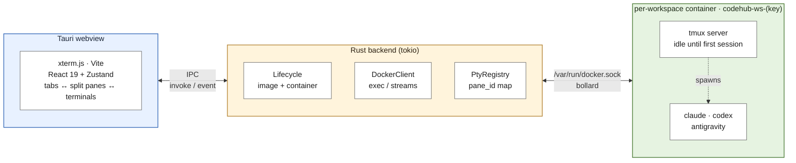
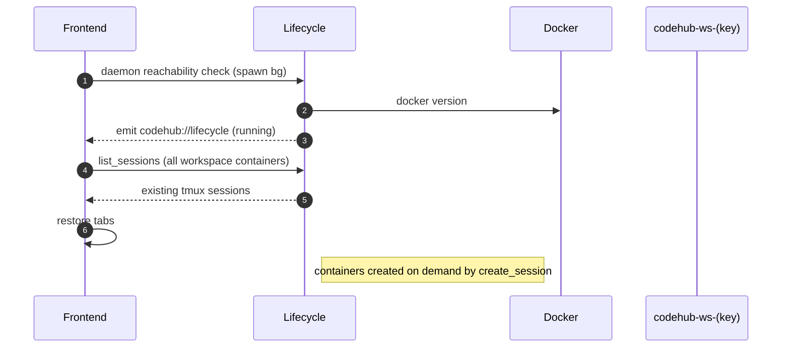
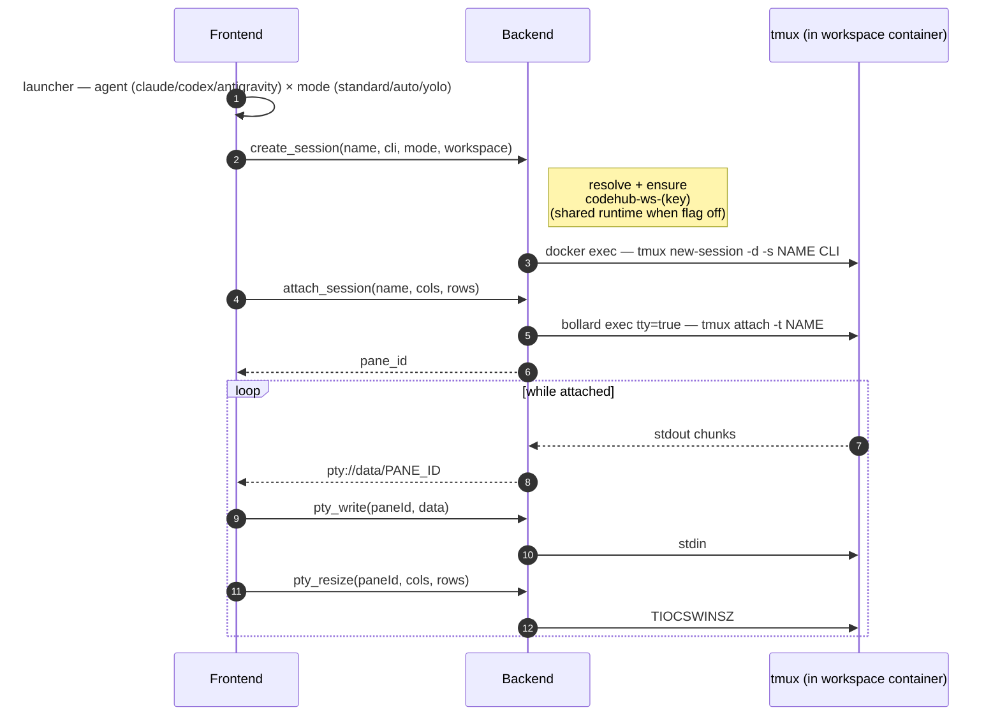

# CodeHub

A home for your AI coding agents.

Tauri desktop app that runs **Claude Code**, **Codex**, and **Antigravity** CLIs in sandboxed Docker containers, multiplexed via tmux. Each pane = one tmux session = one agent; tabs hold one or more split panes. Each workspace gets its own container (`codehub-ws-<key>`) so its cpu/mem/network/state report as real, isolated data. CodeHub spawns and manages containers itself — no `docker compose` step.

## Why

Running multiple agent CLIs locally is messy: separate terminals, separate auth, no unified view, no isolation. CodeHub isolates each agent in a tmux session inside a container — one container per workspace by default — and gives you a single window to switch between them.

## Architecture



### Boot sequence



### Per-session lifecycle (new tab, split, or ⌘T)



## Using it

- **Workspaces** — the welcome screen lists saved workspaces (name, directory, last-opened time) with search/filter. Each runs in its own container (`codehub-ws-<key>`) with repos mounted under `/workspace/<repo-name>`. Create new workspaces via the `+` tab button or ⌘⇧N — the 3-step wizard picks repos (local folders + GitHub), container resources (CPU/memory), and the first agent.
- **New agent** — the "New agent" button (⌘A) in the action bar spawns an agent into the current workspace. Choose agent (Claude Code / Codex / Antigravity), permission mode, and placement (split / new tab / new group).
- **Permission modes** — *Standard* (agent asks first), *Auto* (auto-accepts edits, still sandboxed), *YOLO* (skips all approvals; the container is the boundary). Antigravity is Standard-only until its flags are verified.
- **Splits** — split any pane (its head controls, or ⌘\) into a binary tree; drag the divider to resize. Groups organize splits; each tab holds one or more groups.
- **Hub panels** — a Files browser (⌘E), a workspace Diff viewer (⌘D), and a Resume drawer (⌘R) of past Claude/Codex sessions, docked beside the panes.
- **Command palette** (⌘K) — jump to a view, focus a running session, spawn an agent, or open a recent/connected repo.
- **Views** — Hub, Dashboard, Workspaces (container inspector), Usage (token/cost rollup from session transcripts), Settings (agents · runtime · integrations · appearance · keyboard shortcuts). Three themes: dark, gray, light.
- **GitHub integration** — connect a PAT or sign in via OAuth in Settings → Integrations. Browse repos, see scopes and permissions. Repos appear in the workspace wizard for cloning.
- **Companion** — an always-on-top monitor window mirroring live agent status (working / awaiting input / done / failed) with inline approve/deny. On macOS a native notch "dynamic island" variant exists (experimental).
- **Keyboard** — ⌘N new agent · ⌘⇧N new workspace · ⌘⇧T new workspace tab · ⌘A add agent (split) · ⌘W close focused · ⌘⇧W close workspace · ⌘\ split · ⌘⇧\ split column · ⌘⇧B shell · ⌘E files · ⌘D diff · ⌘R resume · ⌘1–9 jump tab · ⌘K palette · ⌘/ shortcuts.

## Runtime image

Lives in `runtime/`. See `runtime/README.md` for build and publish instructions.

## Prerequisites

- Rust toolchain (`rustup`, stable)
- Node 20+
- Docker Desktop running
- macOS / Linux (Windows untested)

## Setup

```bash
git clone https://github.com/mpolatcan/codehub.git
cd codehub
npm install

# Build runtime image locally (or wait for app to pull from the registry on first launch)
make image

# Dev mode (hot reload frontend, rebuild Rust on change)
make dev
```

> See `make help` for the full target list (`build`, `check`, `fix`, `image-verify`, …).

### Browser mode (dev bridge)

The Tauri webview (WKWebView) has no remote-debugging port, so the UI can't be
inspected or screenshotted from outside the app. For visual work, `make dev-web`
runs the frontend in a plain browser at <http://127.0.0.1:1420> against a real
backend — a feature-gated HTTP/WebSocket bridge that mirrors the Tauri IPC
surface. It is **dev-only** and never compiled into the shipped app.

```bash
make dev-web   # Vite + standalone backend bridge, no Tauri window
```

Override defaults:

| Env var | Purpose | Default |
|---|---|---|
| `CODEHUB_IMAGE` | Image tag to use (all containers) | `ghcr.io/mpolatcan/codehub-runtime:0.1.3` |
| `CODEHUB_NETWORK_MODE` | Docker network mode | `bridge` |
| `CLAUDE_CODE_OAUTH_TOKEN` | Skip `/login` in Claude Code | unset |

## Production build

```bash
make build
```

Bundles a `.dmg` on macOS, `.AppImage`/`.deb` on Linux. Output at `src-tauri/target/release/bundle/`.

## Volume layout

CodeHub stores all state under the OS app-data dir, namespaced by the bundle identifier
configured in `src-tauri/tauri.conf.json`.

| Platform | Host path | Container path | Purpose |
|---|---|---|---|
| macOS   | `~/Library/Application Support/<bundle-id>/config`    | `/config`    | Per-CLI auth state |
| macOS   | `~/Library/Application Support/<bundle-id>/workspace` | `/workspace` | Project files |
| Linux   | `~/.local/share/<bundle-id>/config`                   | `/config`    | Per-CLI auth state |
| Linux   | `~/.local/share/<bundle-id>/workspace`                | `/workspace` | Project files |

## Roadmap

- [ ] Multiple bind mounts per workspace (frontend ready, backend `lifecycle.rs` needs multi `-v` flags)
- [ ] Git clone inside container for GitHub repos (`docker exec git clone`)
- [ ] Container resource limits enforcement (`--cpus`, `--memory` flags in `lifecycle.rs`)
- [ ] macOS Keychain for OAuth token storage (`security-framework` crate)
- [ ] Native OS notifications when an agent finishes
- [ ] Auto-update via Tauri updater plugin
- [ ] App icon set
- [ ] Code-split the frontend bundle
