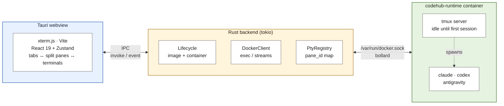
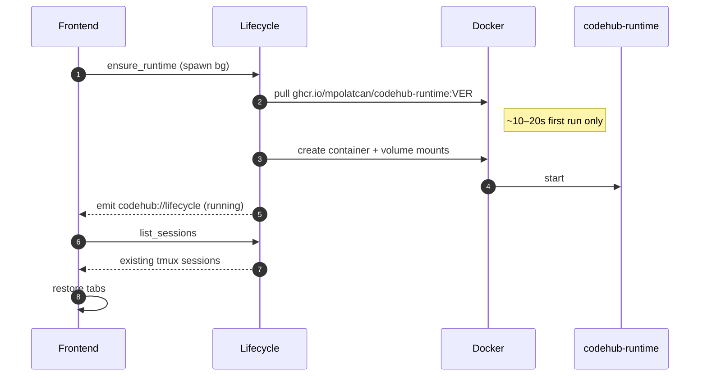
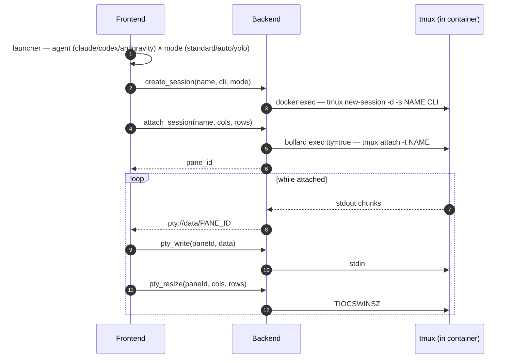

# CodeHub

A home for your AI coding agents.

Tauri desktop app that runs **Claude Code**, **Codex**, and **Antigravity** CLIs inside a single sandboxed Docker container, multiplexed via tmux. Each pane = one tmux session = one agent; tabs hold one or more split panes. CodeHub spawns and manages the container itself — no `docker compose` step.

## Why

Running multiple agent CLIs locally is messy: separate terminals, separate auth, no unified view, no isolation. CodeHub isolates each agent in its own tmux session inside one container, and gives you a single window to switch between them.

## Architecture



### Boot sequence



### Per-session lifecycle (new tab, split, or ⌘T)



## Using it

- **New session** — the `+` popover (or ⌘T) picks an agent and a permission mode.
- **Permission modes** — *Standard* (agent asks first), *Auto* (auto-accepts edits, still sandboxed), *YOLO* (skips all approvals; the container is the boundary). Antigravity is Standard-only until its flags are verified.
- **Splits** — split any pane (its head controls, or ⌘\) into a binary tree; drag the divider to resize.
- **Keyboard** — ⌘T new tab · ⌘W close focused · ⌘\ split · ⌘1–9 switch tab.

## Runtime image

Lives in `runtime/`. See `runtime/README.md` for build and publish instructions.

## Prerequisites

- Rust toolchain (`rustup`, stable)
- Node 20+
- Docker Desktop running
- macOS / Linux (Windows untested)

## Setup

```bash
git clone https://github.com/mpolatcan/codehub.git
cd codehub
npm install

# Build runtime image locally (or wait for app to pull from the registry on first launch)
make image

# Dev mode (hot reload frontend, rebuild Rust on change)
make dev
```

> See `make help` for the full target list (`build`, `check`, `fix`, `image-verify`, …).

### Browser mode (dev bridge)

The Tauri webview (WKWebView) has no remote-debugging port, so the UI can't be
inspected or screenshotted from outside the app. For visual work, `make dev-web`
runs the frontend in a plain browser at <http://127.0.0.1:1420> against a real
backend — a feature-gated HTTP/WebSocket bridge that mirrors the Tauri IPC
surface. It is **dev-only** and never compiled into the shipped app.

```bash
make dev-web   # Vite + standalone backend bridge, no Tauri window
```

Override defaults:

| Env var | Purpose | Default |
|---|---|---|
| `CODEHUB_CONTAINER` | Container name | `codehub-runtime` |
| `CODEHUB_IMAGE` | Image tag to use | `ghcr.io/mpolatcan/codehub-runtime:0.1.3` |
| `CODEHUB_NETWORK_MODE` | Docker network mode | `bridge` |
| `CLAUDE_CODE_OAUTH_TOKEN` | Skip `/login` in Claude Code | unset |

## Production build

```bash
make build
```

Bundles a `.dmg` on macOS, `.AppImage`/`.deb` on Linux. Output at `src-tauri/target/release/bundle/`.

## Volume layout

CodeHub stores all state under the OS app-data dir, namespaced by the bundle identifier
configured in `src-tauri/tauri.conf.json`.

| Platform | Host path | Container path | Purpose |
|---|---|---|---|
| macOS   | `~/Library/Application Support/<bundle-id>/config`    | `/config`    | Per-CLI auth state |
| macOS   | `~/Library/Application Support/<bundle-id>/workspace` | `/workspace` | Project files |
| Linux   | `~/.local/share/<bundle-id>/config`                   | `/config`    | Per-CLI auth state |
| Linux   | `~/.local/share/<bundle-id>/workspace`                | `/workspace` | Project files |

## Roadmap

- macOS Keychain for OAuth token storage (`security-framework` crate).
- Bell-character detection -> native notification when an agent finishes.
- Copy-mode keybindings.
- Multiple workspaces (one container per workspace dir).
- Auto-update via Tauri updater plugin.
- Icon set (cage grid + bird silhouette).
- Code-split the frontend bundle (currently a single ~707 KB chunk).
